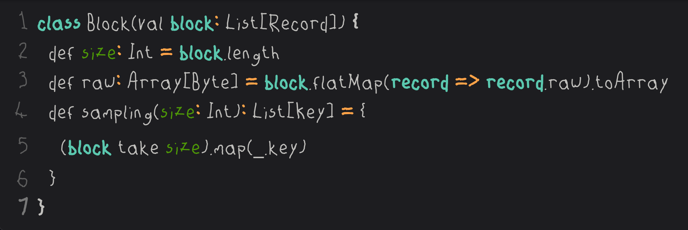

# cheetos-other-hand-font-extended
Custom extension of the Other Hand font by Cheetos
## Why extension?
Original [font](https://www.cheetos.com/otherhand) does not support some glyphs(```"&'*+-/:;<=>[\]^_`{|}~¥§```). These glyphs are added.
## License?
I emailed Cheetos and they said there’s no license. So, I uploaded my extension here, and of course, mine doesn’t have it either!
## How does it look

